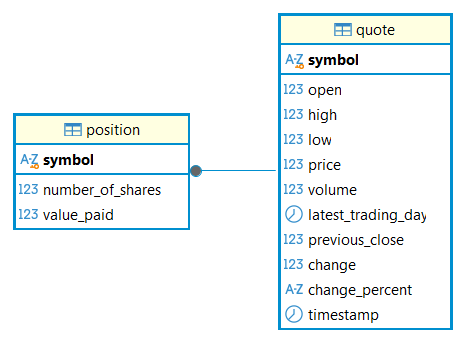

# Stock Quote App

## Introduction

The Stock Quote App is a Java-based command-line application that allows users to retrieve stock quotes, buy and sell shares, and view their portfolio. The application retrieves real-time stock information from the Alpha Vantage API and stores quote and portfolio data in PostgreSQL using JDBC. The project was developed using Java, Maven, PostgreSQL, SQL, JDBC, Jackson, OkHttp, JUnit, Mockito, SLF4J/Log4j, and Docker. The application follows a layered architecture to separate user interaction, business logic, API communication, and database operations.

# Implementation

## ER Diagram

The application uses PostgreSQL to store stock market information and user portfolio data. The database contains two main tables:

- **quote**: Stores stock information retrieved from the Alpha Vantage API, including ticker symbols and market data.
- **position**: Stores user portfolio information, including owned stocks, number of shares, and purchase details.

## Design Patterns

The application follows the **DAO (Data Access Object)** and **Repository** design patterns to organize database communication and improve maintainability.

The DAO layer is responsible for handling all interactions with PostgreSQL through JDBC. Classes such as `QuoteDao` and `PositionDao` contain database operations including inserting, retrieving, updating, and deleting records. This keeps SQL queries and connection management separate from the rest of the application, allowing the service layer to focus only on business logic.

The Repository pattern is reflected through the application's approach of providing a clean interface for accessing stored data. Instead of the controller directly communicating with the database, requests flow through multiple layers. The controller handles user input, the service layer applies business rules, and the DAO layer performs database operations.

For example, when a user buys shares, the request is passed from the `StockQuoteController` to `PositionService`, which validates the request and determines whether an existing position should be updated or a new position should be created. The service then uses `PositionDao` to persist the data in PostgreSQL.

This layered design separates responsibilities between components, making the application easier to test, maintain, and extend.

# Test

The application was tested using both unit tests and integration tests. Integration tests were performed against a real PostgreSQL database running inside a Docker container.

The database environment was created using a PostgreSQL Docker container (`stock-postgres`) and connected to the Java application through a custom Docker network (`stock-network`). Before running tests, the required database tables were initialized and test data was inserted to ensure consistent test results.

The integration tests verify that JDBC operations correctly interact with the database by testing operations such as:

- Saving and retrieving stock quotes
- Updating portfolio positions
- Buying and selling shares
- Retrieving the user's portfolio
- Handling invalid stock symbols and incorrect inputs

Unit tests using JUnit and Mockito were used to test service-layer logic without depending on external systems. Integration tests validated the complete workflow between the controller, service, DAO, and PostgreSQL 
