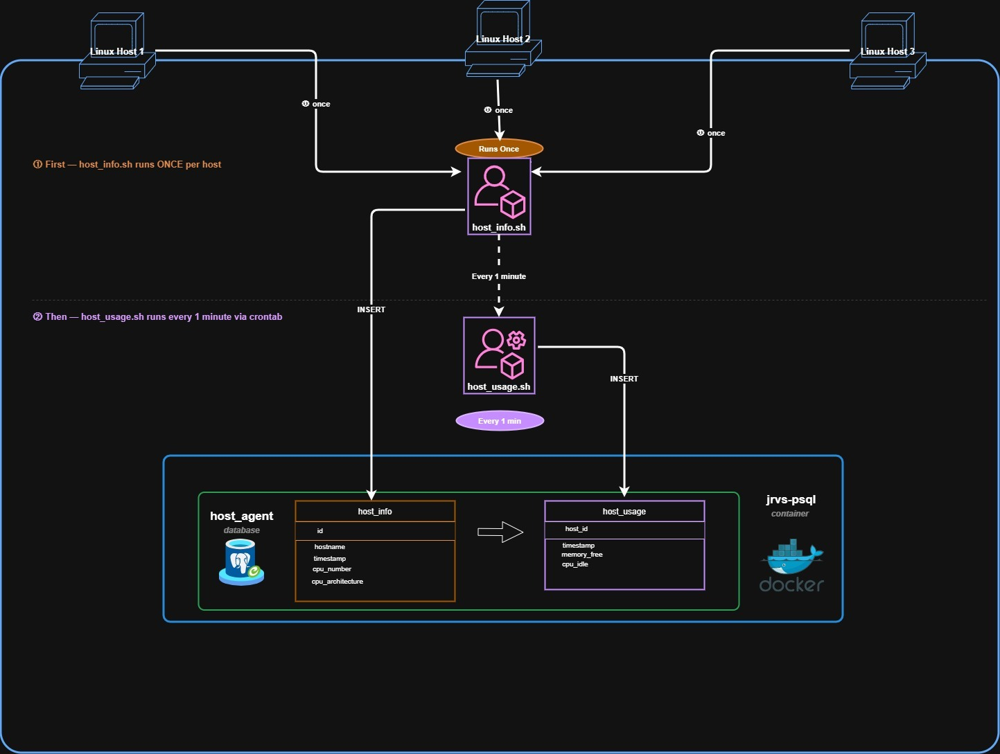

# _Linux Cluster Monitoring Agent_
# Introduction
This project implements an automated Linux monitoring system using Bash scripting to collect and store host-level metrics such as CPU utilization and memory usage. A lightweight monitoring agent runs on each host and executes system commands at regular intervals (every minute) to capture real-time performance data. The collected information is then stored in a centralized PostgreSQL database named ```host_agent```, along with log files for tracking and troubleshooting.

The solution is designed for system administrators, developers, and DevOps engineers who require continuous visibility into system performance without manually executing commands. By automating data collection and storage, the project simplifies monitoring and supports performance analysis over time.

The system is built using a combination of technologies including Bash for scripting, PostgreSQL for data storage, Docker for containerization, and Crontab for scheduling. Additional tools such as Git, GitHub, and Gitflow are used for version control, while SSH and CLI utilities were used for remote access and system interaction.

# Quick Start
**Step 1: Start a psql instance using ```psql_docker.sh```**
> ./scripts/psql_docker.sh start

**Step 2: Create database tables using ```ddl.sql```**
> psql -h localhost -U postgres -d host_agent -f sql/ddl.sql

**Step 3: Insert hardware specs data into the DB using ```host_info.sh```**
> ./scripts/host_info.sh psql_host psql_port db_name psql_user psql_password 

**Step 4: Insert hardware usage data into the DB using ```host_usage.sh```**
> bash scripts/host_usage.sh psql_host psql_port db_name psql_user psql_password

**Step 5: Crontab setup to run every minute**
```
# edit crontab jobs
crontab -e

# add this to crontab
* * * * * bash /path/to/host_usage.sh psql_host psql_port db_name psql_user psql_password  > /tmp/host_usage.log
```
# Implementation
To successfully implement this project, the user must have a Linux environment with Docker installed and configured, along with PostgreSQL and basic command-line knowledge. The system is designed to automate the collection and storage of host-level metrics using Bash scripts and scheduled tasks. Each component works together to ensure continuous monitoring and centralized data storage.
## Architecture
The architecture follows a distributed monitoring model:
- Multiple Linux hosts act as data sources, each running monitoring scripts.
- The bash scripts collect system metrics such as CPU, memory, and disk usage.
- A centralized PostgreSQL database, running inside a Docker container, stores all collected data.
- A scheduler (Crontab) automates periodic executions of the ```host_usage.sh``` script.
- Communication between the hosts and the database are handled using CLI and network connections.


## Scripts
Below are all the scripts implemented in this project and the commands to execute them.
- ### psql_docker.sh
  - Manages the PostgreSQL Docker container by creating, starting, or stopping the database instance.
  - ```./scripts/psql_docker.sh start|stop|create [db_username][db_password]```
- ### host_info.sh
  - Collects static hardware specifications such as CPU details, memory size, and hostname.
  - Inserts the collected data into the ```host_info``` table in the PSQL database.
  - ```./scripts/host_info.sh psql_host psql_port db_name psql_user psql_password```
- ### host_usage.sh
  - Collects dynamic system usage data and inserts it into the ```host_usage``` table in the PSQL database.
  - ```./scripts/host_usage.sh psql_host psql_port db_name psql_user psql_password```
- ### crontab
  - Access the crontab scheduler using ```crontab -e```
  - Add the following code to Crontab for automation every _1 minute._
  - ```* * * * * bash /path/to/host_usage.sh psql_host psql_port db_name psql_user psql_password  > /tmp/host_usage.log```
  - List the crontab jobs using ```crontab -l```
- ### dll.sql
  - Switches to the ```host_agent``` database
  - Automatically creates both ```host_info``` and ```host_usage``` tables if they do not exist.
  - ```psql -h localhost -U postgres -d host_agent -f sql/ddl.sql```
## Database Modeling
### host_info
This table stores the hardware specifications. 

| Variable             | Data Type      | Description                  |
|:---------------------|:---------------|:-----------------------------| 
| **id**               | Serial         | Auto-incremented primary key |
| **hostname**         | Str - unique   | The hostname (hostname -f)   |
| **cpu_number**       | Int (2 digits) | Number of CPU cores          |
| **cpu_architecture** | Str            | CPU architecture type        |
| **cpu_model**        | Str            | CPU model name               |
| **cpu_mhz**          | Float          | CPU speed in MHZ             |
| **l2_cache**         | Int (4 digits) | Cache size in KB             |
| **"timestamp"**      | Timestamp      | Record creation time in UTC  |
| **total_mem**        | Int (4 digits) | Total memory available in KB |


### host_usage
This table stores changeable data with its timestamp and related host, linked using ```host_id```.

| Variable           | Data Type      | Description                            |
|:-------------------|:---------------|:---------------------------------------|
| **"timestamp"**    | Timestamp      | Record creation time in UTC            |
| **host_id**        | Serial         | Foreign key from ```host_info``` table |
| **memory_free**    | Int (4 digits) | The size of free memory in MB          |
| **cpu_idle**       | Int (2 digits) | Idle CPU percentage                    |
| **cpu_kernel**     | Int (2 digits) | Kernel CPU percentage                  |
| **disk_io**        | Int (4 digits) | Number of disk I/O                     |
| **disk_available** | Int (4 digits) | Available disk space in MB             |

# Test
As part of the Software Development Life Cycle (SDLC), testing was performed after each component was implemented to ensure correctness and reliability. Multiple testing techniques were used to validate functionality and confirm expected behavior.
1. ```psql_docker.sh```: I tested all the different functionalities of the script ( ```start | stop | create```) to confirm no errors were present.
2. ```dll.sql```: I started my Docker container using the [psql_docker.sh](#psql_dockersh) script, then I connected to the PSQL  instance using ```psql -h localhost -U postgres -W```. I connected to the ```host_agent``` database using ```\c host_agent;``` sql script. Finally, I ran ```/dt``` to confirm that the tables have been created.
3. ```host_info.sh```: I tested the script using the [host_info.sh](#host_infosh) execution command to make sure no errors were present. In case of any error, I utilized the ```-x``` feature for the bash scripts to debug.
4. ```host_usage.sh```: I ran the execution command for [host_usage.sh](#host_usagesh) to check the results, following a similar technique in testing the ```host_info.sh``` script.
5. ```crontab```: I verified the command is running every minute by running my Docker container, running the psql instance connection command, switching to the ```host_agent``` database, and finally running the following SQL script: ```SELECT * FROM host_usage;```. I had to wait for a couple of minutes before testing, and then I confirmed that the insertion was happening every minute by checking the timestamp attribute.
After confirming the successful results of all the tests, I was able to move forward with my deployment.
# Deployment
This project was deployed using multiple parts:
- **Docker** - used for its containers, so PSQL can run inside it for portability. The container starts by deploying [psql_docker.sh](#psql_dockersh), which is followed by starting the PSQL instance using ```psql -h localhost -U postgres -W```.
- **GitHub** - stores the main shared code. All branches were created from the ```develop``` branch, which was created from the ```main``` branch. This project included 3 feature branches:
  - ```feature/psql_docker```: contains the [psql_docker.sh](#psql_dockersh) script. 
  - ```feature/rdbms_dll```: contains the [dll.sql](#dllsql) script.
  - ```feature/monitoring_agent```: contains [host_info.sh](#host_infosh), [host_usage.sh](#host_usagesh), and the [crontab](#crontab) scripts.
- **Crontab** - used for code automation in a specified time period, in this case, every minute.
- **Linux environment** - Scripts executed on the host machine using CLI.
# Improvements 
While the project was successful, there is always room for improvement. Some of the areas I would like to improve are:
- **Add an alerting system:** The system currently stores metrics without notifying users of any issues. However, if the user was notified of low memory available or any other alerts, they can take the appropriate precautions.
- **Handle hardware updates:**  the project is built in a way that the ```host_info``` table is not really edited if the host already exists. However, sometimes users might change the RAM or other hardware specifications that are not checked later.
- **Data visualization dashboard:** the project would be more user-friendly if the ```host_usage``` information  were displayed in a diagram rather than in SQL queries only.
